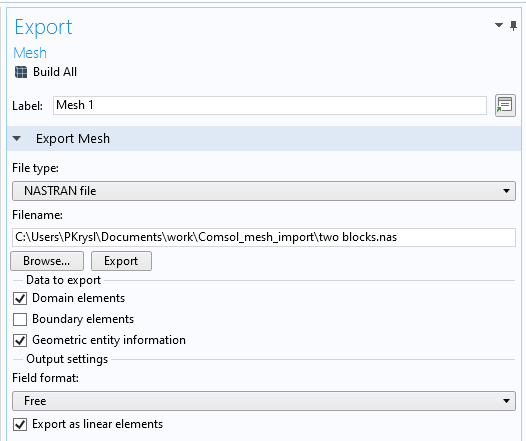

# README

Summary: Run the solution of the free vibration problem for multimaterial domains created in Comsol.

## Set up the simulation

### Create the mesh

Use Comsol to create a mesh. Make sure to create materials for each material domain and  assign the material to the domain. The material parameters don't matter: the materials are not exported themselves. Just the mesh. Remember the numbers of the materials (1, 2, ...): the parameter file  will need to refer to these numbers.

### Export  the mesh

Export the mesh as a NASTRAN file. Use the settings shown in this image:


### Create a parameter file


Create the parameter file for the simulation. Call this file whatever you wish. There is an example  of such a parameter file, called `"twoblocks.json"`. The parameter file is a JSON file with this structure:
```
{
    "meshfile": "twoblocks.nas",
    "neigvs": 20,
    "frequencyshift": 10.0,
    "materials": {
        "2": {
            "name": "aluminum",
            "E": 7.0e10,
            "nu": 0.34,
            "rho": 2700.0
        },
        "1": {
            "name": "steel",
            "E": 2.05e11,
            "nu": 0.3,
            "rho": 7850.0
        }
    }
}
```
Change the parameters appropriately. Materials can be added. Note that the numbers of the materials in the Comsol model are recorded here as strings. 

## Edit the script to run the simulation

Edit the file `run.jl`. There is an example of this file in the current folder with the following contents:
```
using Pkg; 
Pkg.activate("."); Pkg.instantiate()
using FinEtoolsMultimaterialVibEP: solve_ep

# The name of the parameter file is up to you
parameterfile = "twoblocks.json"
solve_ep(parameterfile)

exit()
```
Note that the name of the parameter JSON file is the one created in the previous section.

## Run the simulation

Run the script  `run.jl` in Julia as follows
```
julia run.jl
```
It is possible that the first time this script is run  it will take longer: an update of the Julia  registry needs to be performed so that all the packages needed for the simulation are installed.
When the script finishes, it prints the computed natural frequencies, and it writes out the output into files.


## Results

Assuming as above that the parameter file was called  `"twoblocks.json"`, the following files will be produced:

- Eigenvalues. The file   `twoblocks-eval.mat` holds the angular frequencies squared.
- Eigenvectors. The files `twoblocks-evec1.mat` to `twoblocks-evecN.mat`, where N is the number of requested eigenvalues, hold the individual eigenvectors.
- The surface panels. The surface mesh is recorded in the files `twoblocks-surface.mesh` (definition of the mesh properties),   `twoblocks-surface-conn.dat` (connectivity of the surface panels), `twoblocks-surface-xyz.dat` (coordinates of all the nodes in the mesh).  
- Areas of the surface panels. The file `twoblocks-areas.mat` records the areas of the surface panels in the order in which the connectivity is given.
- Acoustic coupling matrix. The file `twoblocks-G.mat` stores the sparse matrix in three columns that define the vectors I, J, V that can be passed to the function that constructs a sparse matrix from a triple vectors.


